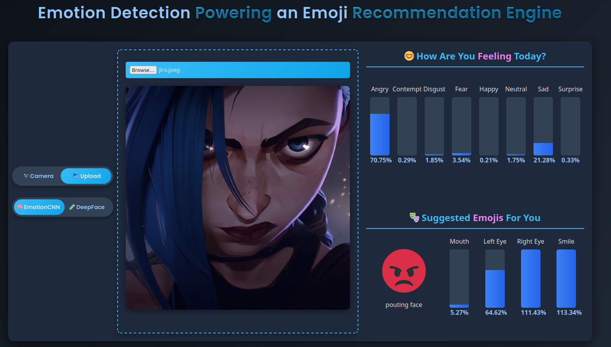

# Face-Based Emoji Recommendation Engine

### Introduction
This project is a face-based emoji recommendation engine that takes an image of a face as input and recommends an emoji that best matches the emotion shown on the face as well as 4 other face landmarks.




### Installation
1. Clone this repository
2. Install the required packages using the following command:
```bash
pip install -r requirements.txt
```

### Usage
1. Run the following command to start the application:
```bash
python app.py
```
2. Open a web browser and navigate to `http://localhost:5002/`
2. Allow Camera acess
4. Or Upload an image of a face.

### Project Structure
- `app.py`: The main script that runs the Flask application.
- `templates/`: Contains the HTML template and its styles.
- `models/`: Contains our pre-trained model for emotion recognition.
- `app_utils.py`: Contains utility functions for face landmarks recognition.
- `dataset/`: Contains the dataset used to map emojis to emotions and face landmarks as well as the data used to evaluate the emoji recommendation engine.
- `evaluations/`: Contains the scripts used to evaluate our trained emotion recognition model as well as deepface.
- `model_utils`: Contains the architecture of the emotion recognition model, the data generator, the preprocessing functions, and the training script.
- `monitor`: Contains the script to monitor the model's convergence.
- `final_metric.ipynb`: Contains the final metric used to evaluate the emoji recommendation engine.
- `requirements.txt`: Contains the required packages for this project.
- `assets/`: Contains the images used in the README.

### Contributors
- [Gabriel Mercier]
- [Brahim Touayouch]